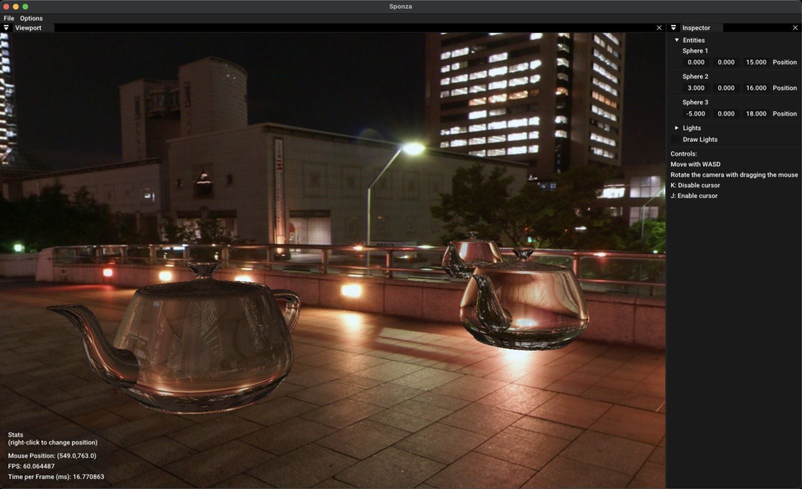
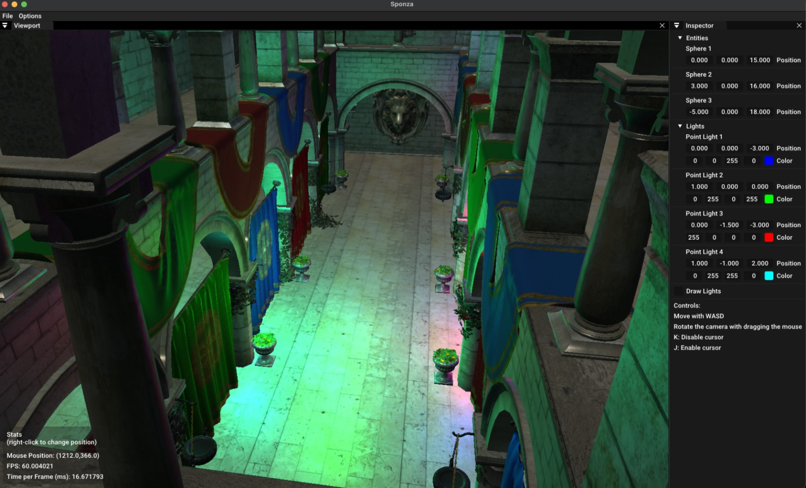
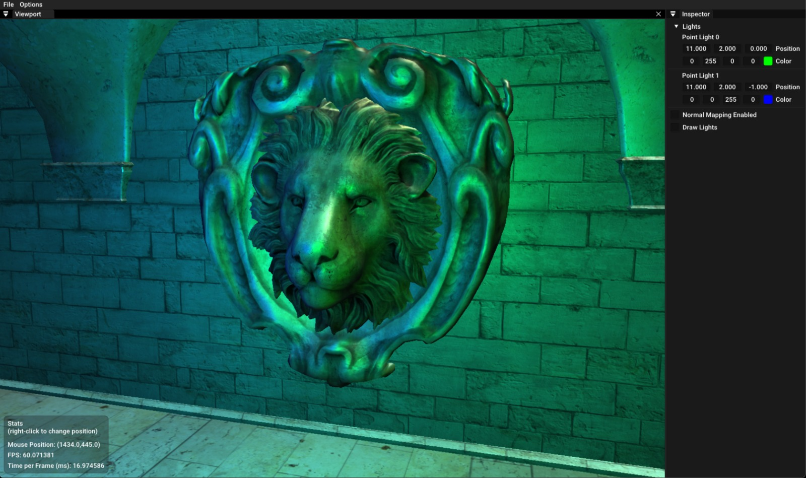
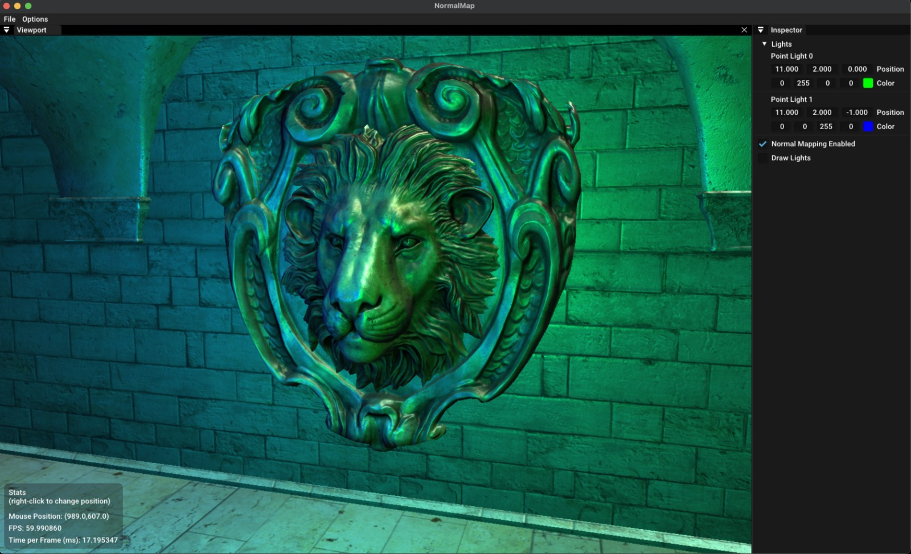
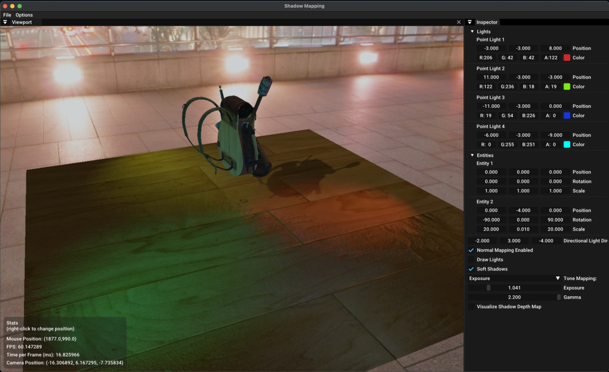

Engine type of thing that is built while learning OpenGL.
The code may be trash rn, because I don't like C++ ZMANG!

Features:

* Skybox + Environment Mapping Reflections/Refractions

* Phong Lighting with Forward Rendering with ImGui

Normal Map Disabled             |  Normal Map Enabled
:-------------------------:|:-------------------------:
  |  

Soft PCF Shadow Mapping + HDR Tonemapping Algorithms (ACES Filmic, Exposure, Reinhard, Uncharted 2)

Project Roadmap (in order)
* ~~HDR~~/Bloom
* Cascading Shadow Maps (for better shadows)
* Deferred Renderer (replace with Tiled Forward or Clustered Forward in the future)
* Organizing code (very important since the code is shit)
* PBR implementation
* Parallax Mapping
* Support for Geometry Shaders
* Instancing
* Batch Rendering
* Support for Compute Shaders
* Atmospheric Scattering
* Volumetric Clouds
* Terrain Rendering / Tesellation Shaders
* Skeletal Animation
* Shadows (~~directional light~~)
* ~~Normal Mapping~~

made possible thanks to learnopengl.com.

To create a new Application, type:
`sh generate_app.sh -p YOUR_APP_LOCATION -n YOUR_APP_NAME`

Note that `YOUR_APP_LOCATION` must be in one of the directories that CMake knows, such as

- `apps/`
- `src/`
- `include/`

Example:

`sh generate_app.sh -p apps/learnopengl -n DepthTest` 

This will create 2 files: `DepthTest.h` and `DepthTest.cpp` which is a boilerplate code for a new application.
Also the script will generate the necessary build files both in `Release` and `Debug`.

Once you have made your app, you can go to `src/main.cpp` and instantiate your app.

Note: 
`res/models` folder is not included in this repo since the files are too large. Download them using [this link]()

Example Apps:

Mandelbrot Set:

