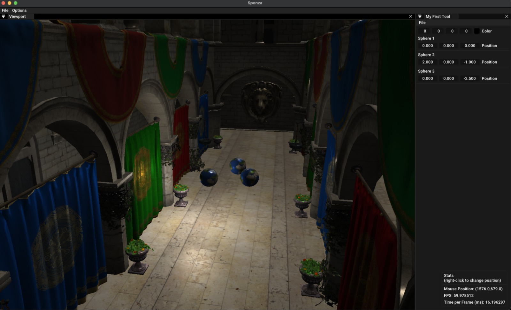

Engine type of thing that is built while learning OpenGL.
The code may be trash rn, because I don't like C++ ZMANG!

Mandelbrot Set:

Sponza Model:

xdd

made possible thanks to learnopengl.com.

To create a new Application, type:
`sh generate_app.sh -p YOUR_APP_LOCATION -n YOUR_APP_NAME`

Note that `YOUR_APP_LOCATION` must be in one of the directories that CMake knows, such as

- `apps/`
- `src/`
- `include/`

Example:

`sh generate_app.sh -p apps/learnopengl -n DepthTest` 

This will create 2 files: `DepthTest.h` and `DepthTest.cpp` which is a boilerplate code for a new application.
Also the script will generate the necessary build files both in `Release` and `Debug`.

Once you have made your app, you can go to `src/main.cpp` and instantiate your app.

Note: obj models are not included in this repo so good luck on finding them ZMAAANG!!!! xdd
